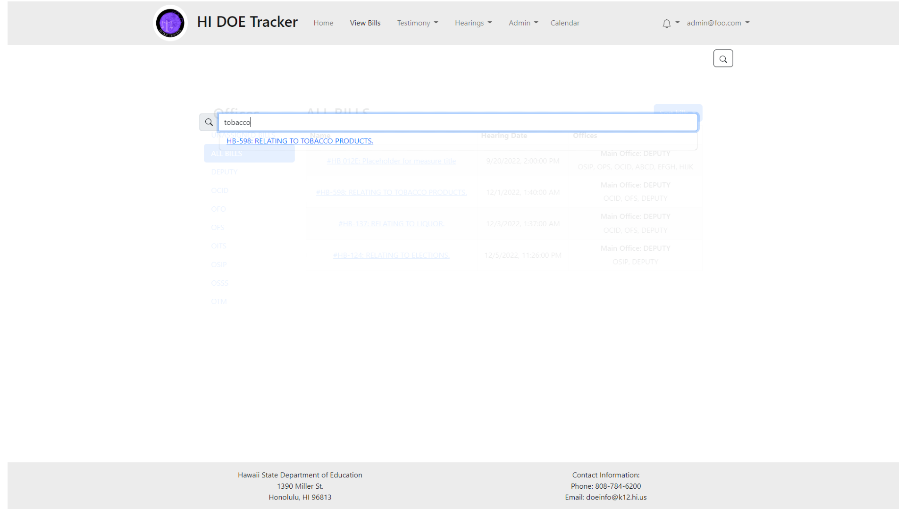
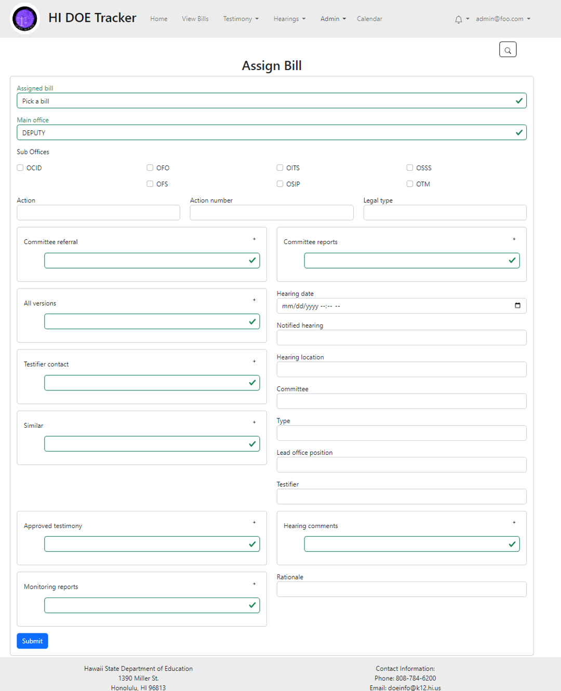

# ICS414 F22 Team 3 "hi-doe-tracker"

## Table of Contents

* [Team Members](#team-members)
* [Contract](#contract)
* [Mockup Pages](#mockup-pages)
* [Continuous Intergration](#continuous-intergration)
* [Link To Deployed App](#link-to-deployed-app)

## Team Members:

- Charlie Robison
- Trevor Kansaki
- Kirsten-Elise Rensaa
- Bhavanika Yadav
- Ujjwal Gautam
- Gaila Feliza Mae Galano
- Alvin Jeremy Edrada
- Tanner Young
- Ryan Fitzpatrick
- Gunwook Baik

## Contract:
Our contract can be found [here](https://docs.google.com/document/d/1LmFmwsgEDfUC2oPU8WfnxhdM-HfBvE7AS4HScb7kDkc/edit?usp=sharing).

## Mockup Pages

### Landing Page

### Home Page

### View Bills Page

### Search

### View Bill Page

### Assign Bill Page

### Hearings Page

### Send Hearing Notice Page

### Submit Testimony Page

### List Testimony Page

### Profile Page

### Create Account Page

### Manage Accounts Page

### Calendar Page

## Continuous Intergration
HI-DOE-Tracker uses GitHub Actions to automatically run ESLint and TestCafe each time a commit is made to the main branch. You can see the results of all recent “workflows” at [https://github.com/hi-doe-tracker/hi-doe-tracker/actions](https://github.com/hi-doe-tracker/hi-doe-tracker/actions).

## Link To Deployed App:
[Deployed App](https://hidoetracker.lol/)